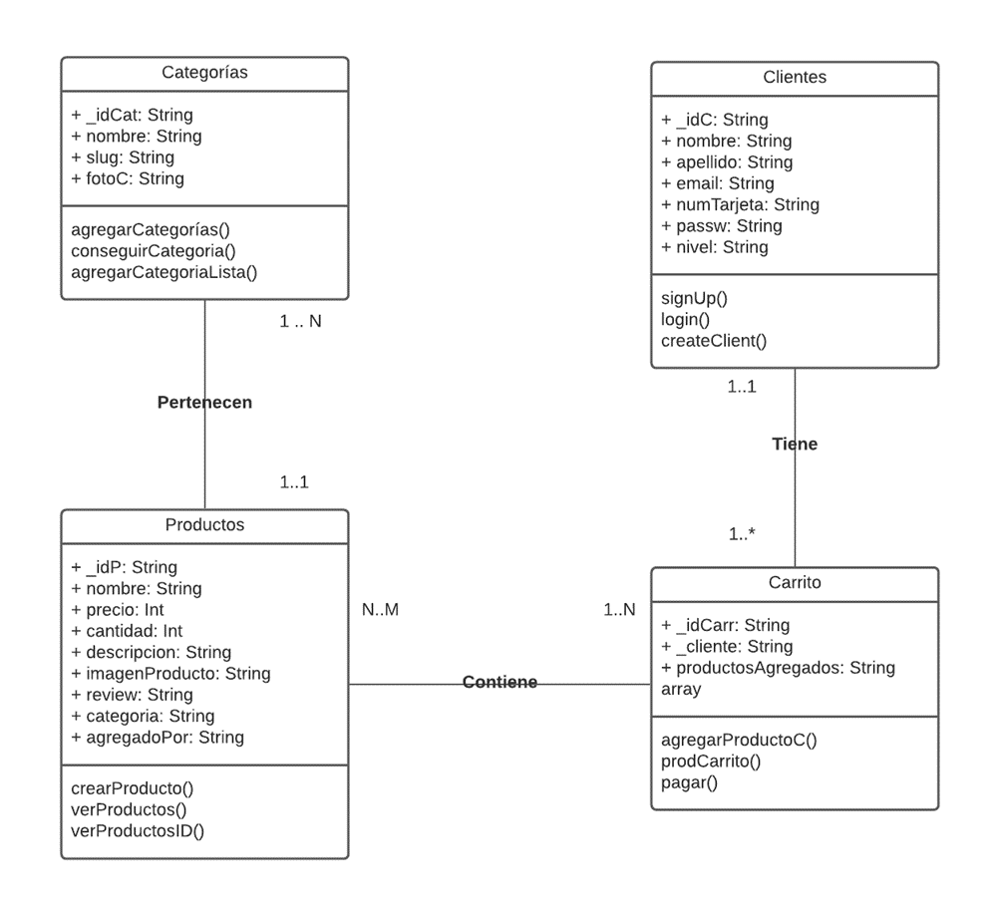
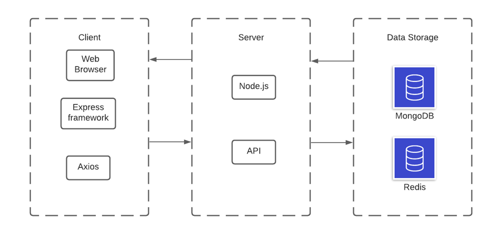

# TC3041 Proyecto Final

# *Perrihijos*
---

##### Integrantes:
1. *Fernando Garrote De la Macorra* - *A01027503* - *Santa Fe*
2. *Rodrigo Benavente García* - *A01026973* - *Santa Fe*

---
## 1. Aspectos generales

Las orientaciones del proyecto se encuentran disponibles en la plataforma **Canvas**.

Este documento es una guía sobre qué información debe entregar como parte del proyecto, qué requerimientos técnicos debe cumplir y la estructura que debe seguir para organizar su entrega.

### 1.1 Requerimientos técnicos

A continuación se mencionan los requerimientos técnicos mínimos del proyecto, favor de tenerlos presente para que cumpla con todos.

* El equipo tiene la libertad de elegir las tecnologías de desarrollo a utilizar en el proyecto.
* El proyecto debe utilizar al menos dos modelos de bases de datos diferentes, de los estudiados en el curso.
* La arquitectura debe ser modular, escalable, con redundancia y alta disponibilidad.
* La arquitectura deberá estar separada claramente por capas (*frontend*, *backend*, *API RESTful*, datos y almacenamiento).
* Los diferentes componentes del proyecto (*frontend*, *backend*, *API RESTful*, bases de datos, entre otros) deberán ejecutarse sobre contenedores [Docker](https://www.docker.com/) o desplegarse en un servicio en la nube.
* Todo el código, *datasets* y la documentación del proyecto debe alojarse en este repositorio de GitHub siguiendo la estructura que aparece a continuación.

### 1.2 Estructura del repositorio
El proyecto debe seguir la siguiente estructura de carpetas:
```
- / 			        # Raíz de todo el proyecto
    - README.md			# Archivo con los datos del proyecto (este archivo)
    - frontend			# Carpeta con la solución del frontend (Web app)
    - backend			# Carpeta con la solución del backend
    - ReadMeFotos          # Carpeta donde las imagenes del readme serán guardadas
```

### 1.3 Documentación  del proyecto


Como parte de la entrega final del proyecto, se debe incluir la siguiente información:

* Justificación de los modelo de *bases de datos* que seleccionaron.
* Descripción del o los *datasets* y las fuentes de información utilizadas.
* Guía de configuración, instalación y despliegue de la solución.
* Documentación de la API (si aplica). Puede ver un ejemplo en [Swagger](https://swagger.io/). 
* El código debe estar documentado siguiendo los estándares definidos para el lenguaje de programación seleccionado.


## 2. Descripción del proyecto

*El equipo decidió hacer una tienda en linea la cual le permite al usuario comprar diferentes artículos. Cada artículo cuenta con descripción, fotos, precio,y nombre. La tienda le permite al usuario crear un carrito en el cual todos los artículos que quiera comprar son agregados para que se pueda realizar un solo pago para todos los artículos. Los usuarios crear sesión con su nombre, email, password y usuario. Se cuenta con una página especial para los administradores en donde se puedan administrar lasc ategorías y los productos de la tienda. En la página también se pueden agregar nuevos administradores con su email, nombre, y password.*

## 3. Solución

A continuación aparecen descritos los diferentes elementos que forman parte de la solución del proyecto.

### 3.1 Modelos de *bases de datos* utilizados

MongoDB - El equipo decidió utilizar esta base de datos para almacenar la información de los clientes, productos, categorías, y carrritos. El equipo decidió utilizar esta base de datos ya que encontramos que era muy eficiente y fácil de utilizar con React, lo cual nos permitía acceder a los datos de manera fácil. MongoDB fue nuestra base de datos principal ya que era muy fácil de trabajar los datos.

Redis - El equipo decidió utilizar Redis para poder manejar las sesiones de los usuarios. Redis fue usado ya que se podían crear y destruir sesiones para los usuarios de manera efectiva con esta base de datos. Este base permite crear llaves que tienen un cierto tiempo de vida, por lo que fue perfecto para las sesiones de los usuarios y administradores.

### 3.2 Arquitectura de la solución




### 3.3 Frontend

El equipo decidó hacer una tienda en línea donde los usuarios pueden iniciar sesión, crear sesión y comprar los productos que ellos deseen. La tienda muestra todas las categorías de los productos disponibles al igual que todos los productos disponibles de cada categoría. Cada producto tiene una página donde se puede ver la descripción y precio de ellos, al igual que se puede agregar al carrito del usuario.
En otra página los administradores pueden crear sesiones e iniciarlas para poder agregar productos y categorías a la página.


#### 3.3.1 Lenguaje de programación
El equipo utilizó Javascript para poder hacer el frontend, esto fue posible gracias a que Nodejs nos permite trabajar con Js para poder hacer las páginas de la tienda

#### 3.3.2 Framework
El equipo utilizó Express.js para poder crear un proyecto que pudiera utilizar Nodejs y para que se pudieran crear el proyecto de la tienda en línea.

#### 3.3.3 Librerías de funciones o dependencias
Utilizamos React para hacer las páginas de nuestra tienda.

Utilizamos MongoDB para poder guardar y leer datos de nuestra base de datos.

Utilizamos Nodejs para poder manejar los eventos diferentes de nuestra tienda.

Se instalo con npm install:
* react-bootstrap bootstrap que nos ayuda a poder diseñar las páginas
* react-router-dom es para manejar multiples páginas
* redux react-redux redux-thunk --save  nos permite a manejar datos para que puedan ser utilizados en el UI
* axios lo cual nos ayuda a leer datos de nuetro backend desde nuestro frontend


### 3.4 API o backend


En nuestro backend se pueden encontrar los API que hicimos para poder trabajar con los daos que se encontraran en la base de datos de MongoDB. Pudimos hacer la conexión del backend con nuestra base gracias a Mongoose, lo cual nos permitió poder trabajar con todo lo que guardaramos en nuestra colección dentro de MongoDB trabajando con operaciones CRUD al igual que con operaciones GET y POST. Se utilizó MongoDBCompass y POSTMAN para poder comprobar que las operaciones GET Y POST estuvieran funcionando de la manera deseada.

La otra base de datos que utilizamos fue Redis, para poder manejar las sesiones creadas se descargo Redis con npm install para poder generar las llaves de las sesiones iniciadas. Se utilizó Redis Insight para poder comprobar que las sesiones estuvieran funcionando de la manera correcta.


#### 3.4.1 Lenguaje de programación
Utilizamos el lenguaje Javascript para poder generar las operaciones GET y POST que nos ayudaron a manejar los datos dentro de nuestra colección dentro de MongoDB.

#### 3.4.2 Framework
El equipo utilizó Express.js para poder crear un proyecto que pudiera utilizar Nodejs, el cual nos permitiera trabajar con nuestros diferentes APIs, al igual que con nuestro servidor.
#### 3.4.3 Librerías de funciones o dependencias

Se instalo con npm install:
* jsonwebtoken es utilizado para poder crear tokens de cada sesión iniciada por los usuarios
* nodemon permite que el proyecto se actualize cada vez que se modifica
* dotenv  es para poder utilizar datos de tu .env para poder estar más protegido
* express mongoose nos permite conectarnos a mongodb
* express-validator  nos permite validar los datos que los usuarios envíen
* slugify es para generar los urls con los nombres de los productos/categorias
* multer nos ayuda a subir archivos (fotos)
* cors  nos permite manejar connect/express middleware
* redis que nos permite crear y destruir las sesiones de los usuarios

#### 3.4.4 Endpoints

### Signup Cliente
* **Descripción**: Le permite a los clientes crear una cuenta en nuestra página 
* **URL**: ('http://localhost:5000/api/signup')
* **Verbos HTTP**: POST
* **Formato JSON del cuerpo de la solicitud**: 
   ```  
     {
	"nombre": "string",
	"apellido": "string",
	"email" : "string",
	"passw": "string",
	"numTarjeta": "string",
    "nivel": "normal"
    } 
  ```  
* **Formato JSON de la respuesta**:  
    ```
    res.status(201).json({//regresa mensaje que nos muestra que el admin fue creado
        message: 'Se a creado un cliente'
    })
    ```
* **Códigos de error**: 
    ```
    res.status(400).json({//No se pudo crear al admin
        message: 'Hubo un error creando al cliente'
    })
    ```
    
### Login Cliente
* **Descripción**: Le permite a los clientes iniciar sesión en la tienda
* **URL**: ('http://localhost:5000/api/login')
* **Verbos HTTP**: POST
* **Formato JSON del cuerpo de la solicitud**: 
   ```  
    {
        "email": "string",
        "passw": "string"
    }
  ```  
* **Formato JSON de la respuesta**:  
    ```
    res.status(200).json({
    token,
    client:{
            _id, nombre, apellido, email, nivel, nombreCompleto
           }
    });
    ```
* **Códigos de error**: 
    ```
    Si no se envian los datos correcto se muestra: res.status(400).json({error});
    Si el password y el mail no coinciden se muestra: 
    return res.status(400).json({
        message: 'Accesso Denegado'
    })
    ```    
### Cerrar Sesión Cliente
* **Descripción**: La sesión de cuenta del cliente es cerrada
* **URL**: ('http://localhost:5000/api/admin/cerrarSesion')
* **Verbos HTTP**: POST
* **Formato JSON del cuerpo de la solicitud**: 
   ```  
    {
        "_id": "string",
    }
  ```  
* **Formato JSON de la respuesta**:  
    ```
    res.status(200).json({
        message: 'Se cerró la sesión'
    })
    ```
    
### Signup Administrador
* **Descripción**: Le permite a los clientes crear una cuenta en nuestra página 
* **URL**: ('http://localhost:5000/api/admin/signup')
* **Verbos HTTP**: POST
* **Formato JSON del cuerpo de la solicitud**: 
   ```  
     {
	"nombre": "string",
	"apellido": "string",
	"email" : "string",
	"passw": "string",
    "nivel": "admin",
    } 
  ```  
* **Formato JSON de la respuesta**:  
    ```
    res.status(201).json({//regresa mensaje que nos muestra que el admin fue creado
        message: 'Se a creado un Admin'
    })
    ```
* **Códigos de error**: 
    ```
    res.status(400).json({//No se pudo crear al admin
        message: 'Hubo un error creando al admin'
    })
    ```
 ### Login Administrador
* **Descripción**: Le permite a los clientes iniciar sesión en la tienda
* **URL**: ('http://localhost:5000/api/admin/login')
* **Verbos HTTP**: POST
* **Formato JSON del cuerpo de la solicitud**: 
   ```  
    {
        "email": "string",
        "passw": "string"
    }
  ```  
* **Formato JSON de la respuesta**:  
    ```
    res.status(200).json({
    token,
    client:{
            _id, nombre, apellido, email, nivel, nombreCompleto
           }
    });
    ```
* **Códigos de error**: 
    ```
    Si no se envian los datos correcto se muestra: res.status(400).json({error});
    Si el password y el mail no coinciden se muestra: 
    return res.status(400).json({
        message: 'Accesso Denegado'
    })
    ```        
### Cerrar Sesión Cliente
* **Descripción**: La sesión de cuenta del cliente es cerrada
* **URL**: ('http://localhost:5000/api/admin/cerrarSesion')
* **Verbos HTTP**: POST
* **Formato JSON del cuerpo de la solicitud**: 
   ```  
    {
        "_id": "string",
    }
  ```  
* **Formato JSON de la respuesta**:  
    ```
    res.status(200).json({
        message: 'Se cerró la sesión'
    })
    ```    
### Obtener Datos de las categoráis
* **Descripción**: Le permite a los administradores ver todas las categorías padres y sus hijos, también se pueden ver los productos
* **URL**: ('http://localhost:5000/api/datosIniciales')
* **Verbos HTTP**: GET
* **Formato JSON de la respuesta**:  
    ```
    res.status(200).json({
        categorias: agregarCategoria(categorias),
        productos
    })
    ```
 ### Agregar Categorías
* **Descripción**: Le permite a los administradores crear una nueva categoría padre o hija
* **URL**: ('http://localhost:5000/api/categorias/crear')
* **Verbos HTTP**: POST
* **Formato JSON del cuerpo de la solicitud**: 
   ```  
    {
        "nombre": "string",
        "slug": slugify(req.body.nombre),
        "pId": " req.body.pId,
    }
  ```  
* **Formato JSON de la respuesta**:  
    ```
    res.status(201).json({categoria});
    ```
* **Códigos de error**: 
    ```
    return res.status(400).json({error});
    ```        
### Conseguir categorias
* **Descripción**: Se ven todas las categorás padres e hijas
* **URL**: ('http://localhost:5000/api/categorias/vercategorias')
* **Verbos HTTP**: GET
* **Formato JSON de la respuesta**:  
    ```
    res.status(200).json({listaCategorias});
    ```
* **Códigos de error**: 
    ```
    return res.status(400).json({
        return res.status(400).json({error});
    })
    ```    
### Agregar Productos al Carrito
* **Descripción**: Le permite a los clientes agregar productos a sus carritos
* **URL**: ('http://localhost:5000/api/usuario/carrito/agregar')
* **Verbos HTTP**: POST
* **Formato JSON del cuerpo de la solicitud**: 
   ```  
   {
	"cliente": "string",
	"productosAgregados":[{
		"cantidad": int,
		"productos" : "string"
	}]
  }
  ```  
* **Formato JSON de la respuesta**:  
    ```
    res.status(201).json({ response }))
    ```
* **Códigos de error**: 
    ```
    res.status(400).json({ error }))
    ```
### Agregar Productos al Carrito
* **Descripción**: Le permite a los clientes ver su carrito actual con los productos que ha agregado
* **URL**: ('http://localhost:5000/api/usuario/verCarrito')
* **Verbos HTTP**: POST
* **Formato JSON del cuerpo de la solicitud**: 
   ```  
    {
	    "cliente":"string"
    }
  ```  
* **Formato JSON de la respuesta**:  
    ```
    res.status(200).json({ productosAgregados });
    ```
* **Códigos de error**: 
    ```
    res.status(400).json({ error }))
    ```
### Compar y borrar carrito
* **Descripción**: Le permite a los clientes comprar los productos dentro su carrito y lo vacía
* **URL**: ('http://localhost:5000/api/usuario/borrarCarrito')
* **Verbos HTTP**: POST
* **Formato JSON del cuerpo de la solicitud**: 
   ```  
    {
	    "client": "string"
    }
  ```  
* **Formato JSON de la respuesta**:  
    ```
    res.status(200).json({ 
        message: "Se borró el carrito"
    });
    ```
* **Códigos de error**: 
    ```
    res.status(400).json({ error }))
    ```
### Compar y borrar carrito
* **Descripción**: Le permite a los clientes comprar los productos dentro su carrito y lo vacía
* **URL**: ('http://localhost:5000/api/usuario/borrarCarrito')
* **Verbos HTTP**: POST
* **Formato JSON del cuerpo de la solicitud**: 
   ```  
    {
	    "client": "string"
    }
  ```  
* **Formato JSON de la respuesta**:  
    ```
    res.status(200).json({ 
        message: "Se borró el carrito"
    });
    ```
* **Códigos de error**: 
    ```
    res.status(400).json({ error }))
    ```
### Agregar productos a la página
* **Descripción**: Le permite a los administradores agregar productos a la tienda
* **URL**: ('http://localhost:5000/api/productos/crear')
* **Verbos HTTP**: POST
* **Formato JSON del cuerpo de la solicitud**: 
   ```  
    {
	    "nombre": "string",
        "cantida": "int",
        "precio": "int",
        "descripcion": "string",
        "imagenProducto[]": "string",
        "categoria": "string"
    }
  ```  
* **Formato JSON de la respuesta**:  
    ```
    res.status(201).json({ producto });
    ```
* **Códigos de error**: 
    ```
    return res.status(400).json({ error });
    ```
### Ver todos los productos disponibles en la tienda para venta
* **Descripción**: Le permite a clientes ver los productos en la tienda
* **URL**: ('http://localhost:5000/api/productos/:slug')
* **Verbos HTTP**: GET
* **Formato JSON de la respuesta**:  
    ```
    res.status(200).json({//Si se pueden recuperar los productos de la categoría
        slug,
        productos,
    });
    ```
* **Códigos de error**: 
    ```
    return res.status(400).json({
        error: 'Hubo un error'
    })
    ```
### Ver productos que tengan cierto id 
* **Descripción**: Le permite a clientes ver las páginas de cada producto
* **URL**: ('http://localhost:5000/api/producto/:productoId')
* **Verbos HTTP**: GET
* **Formato JSON de la respuesta**:  
    ```
    res.status(200).json({
        producto
    });
    ```
* **Códigos de error**: 
    ```
    return res.status(400).json({
        error: 'Hubo un error'
    })
    ```    
    
## 3.5 Pasos a seguir para utilizar el proyecto

Para poder utilizar este poryecto es necesario seguir estos pasos:
1. Abrir la carpeta en donde se desee clonar este repositorio
2. Clonar el repositorio con git clone https://github.com/tec-csf/tc3041-pf-primavera-2021-team9
3. Abrir y correr Docker
4. En dos terminales diferentes abrir las carpetas de "backend" y "frontend"
5. En la terminal del frontend agregar la imagen en un contenedor con este comando: docker build -t nodejs:perrihijost .
6. En la terminal del frontend correr el contenedor con este comando: docker run --name pt -p 3000:3000 -d nodejs:perrihijost
7. En la terminal del backend agregar la imagen en un contenedor con este comando: docker build -t nodejs:perrihijoss .
8. En la terminal del backend correr el contenedor con este comando: docker run --name ps -p 5000:5000 -d nodejs:perrihijoss
9. Cuando se acabe de utilizar el proyecto se necesita apagar los contendores con el siguiente comando: docker stop $(docker ps -aq)

## 4. Referencias

    * https://react-bootstrap.netlify.app/components/modal/#modals
    * https://react-bootstrap.netlify.app/components/table/#table-responsive
    * https://www.youtube.com/watch?v=OH6Z0dJ_Huk&ab_channel=CodeRealm
    * https://react-bootstrap.github.io/
    * https://reactjs.org/docs/getting-started.html
    * https://www.npmjs.com/package/multer


